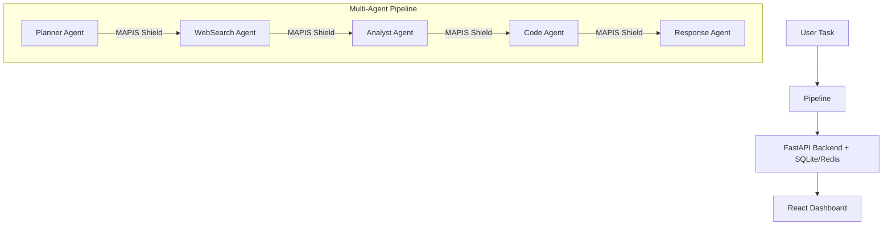

# MAPIS (Multi-Agent Prompt Injection Shield) Project Report

> [!NOTE]
> This is a comprehensive analysis of the MAPIS project base, providing a complete explanation of the project's purpose, architecture, and a file-by-file breakdown of the codebase.

## 1. Project Overview & Explanation

**MAPIS (Multi-Agent Prompt Injection Shield)** is a real-time, stateful defense system built to protect multi-agent LLM pipelines from **indirect prompt injection attacks**. 

In modern AI applications, systems are often built using multiple AI agents passing information to one another. Attackers exploit this by hiding malicious instructions in documents, which are subsequently read by agents and can silently hijack the entire pipeline across multiple agent hops. 

### Why is MAPIS Novel?
Existing guardrails (like Llama Guard or NeMo) are **stateless**. They evaluate each message in isolation and lack memory of the conversation context. MAPIS introduces a **stateful defense**. It maintains a rolling session history for each agent communication channel and computes a "trust score" for every inter-agent message based on the entire conversation context. This allows MAPIS to detect chained multi-hop attacks that unfold gradually, filling an open research gap for multi-agent LLM systems.

**Key Capabilities:**
- 🛡️ **Stateful Trust Scoring:** Detects behavioral drift and multi-hop attacks over a session.
- 🎯 **8 Attack Categories:** Direct override, goal hijacking, data exfiltration, privilege escalation, role injection, instruction embedding, context manipulation, and tool abuse.
- 🕵️ **Obfuscation Detection:** Handles zero-width characters, base64, and unicode homoglyphs.
- ⚡ **Real-Time Dashboard:** WebSocket-powered live monitoring via a React frontend.

---

## 2. System Architecture

The architecture consists of a multi-agent backend pipeline acting as a testbed, protected by the core MAPIS scoring middleware, and visualised via a React frontend.

When an agent passes a message to another, MAPIS intercepts it and computes a trust score based on:
1. **Pattern Score (45%):** Regex-based injection pattern detection.
2. **Drift Score (20%):** Detection of subtle behavioral manipulation.
3. **Anomaly Score (25%):** Session anomalies against history.
4. **Entropy Score (10%):** Obfuscation detection.
5. **Session Penalty:** Cumulative stateful memory penalty applied to the final score.

---

## 3. Codebase File Analysis

### 📁 Root Directory
- [`README.md`](file:///v:/SEM_7/Final_project/MAPIS/README.md): High-level project summary, features, and quick start guide.
- [`SETUP.md`](file:///v:/SEM_7/Final_project/MAPIS/SETUP.md): Comprehensive guide on running the project locally or via Docker, architectural breakdown, and API documentation.
- [`docker-compose.yml`](file:///v:/SEM_7/Final_project/MAPIS/docker-compose.yml) & `Dockerfile.*`: Containerization configurations for spinning up the backend, frontend, and a Redis instance easily.
- [`requirements.txt`](file:///v:/SEM_7/Final_project/MAPIS/requirements.txt): Python dependencies for the FastAPI backend (e.g., FastAPI, LangChain, Loguru, SQLAlchemy).

### 📁 Backend (`/backend`)
The backend is a FastAPI application that runs the multi-agent pipeline and the MAPIS trust scorer.

- [`main.py`](file:///v:/SEM_7/Final_project/MAPIS/backend/main.py): The FastAPI application entry point. Handles app initialization, CORS middleware, database startup (`init_db`), and routing.
- [`config.py`](file:///v:/SEM_7/Final_project/MAPIS/backend/config.py): Manages all environment-based configuration variables (e.g., OpenAI API keys, trust thresholds, DB URLs) using Pydantic Settings.

**`/backend/core/` - The Core MAPIS Logic**
- [`trust_scorer.py`](file:///v:/SEM_7/Final_project/MAPIS/backend/core/trust_scorer.py): The crown jewel of the project. Contains the `TrustScorer` class, which manages session states and computes rolling trust scores. It holds extensive `INJECTION_PATTERNS` regex dictionaries and `DRIFT_INDICATORS` to evaluate incoming messages against 8 different attack vectors.

**`/backend/agents/` - The Agent Testbed**
- [`pipeline.py`](file:///v:/SEM_7/Final_project/MAPIS/backend/agents/pipeline.py): Defines a LangGraph-based multi-agent testbed (Planner, Web Search, Analyst, Code, Response). Crucially, it implements `mapis_intercept()`, a middleware function called at every agent-to-agent hop to score the interaction before proceeding.

**`/backend/api/` - Routing**
- [`routes.py`](file:///v:/SEM_7/Final_project/MAPIS/backend/api/routes.py): Defines the REST endpoints (`/scan`, `/pipeline/run`, `/alerts`, `/sessions/{id}`) and WebSocket (`/ws`) handlers for live streaming alerts to the dashboard.

**`/backend/models/` - Data Structures**
- [`schemas.py`](file:///v:/SEM_7/Final_project/MAPIS/backend/models/schemas.py): Pydantic models for data validation. Defines structures like `TrustScore`, `SessionState`, `TrustDecision`, and input/output API schemas.
- [`database.py`](file:///v:/SEM_7/Final_project/MAPIS/backend/models/database.py): SQLAlchemy models for persistent storage of alerts and session logs using an SQLite database (or Postgres if configured).

### 📁 Frontend (`/frontend`)
A React-based single-page application built to visualize the MAPIS dashboard.

- [`src/App.jsx`](file:///v:/SEM_7/Final_project/MAPIS/frontend/src/App.jsx): The main React application file containing the full dashboard UI. It renders real-time statistics cards, a Line/Bar chart (using Recharts) mapping injection attempts over time, and an actionable alert log using data from the backend API/WebSockets.
- [`src/index.js`](file:///v:/SEM_7/Final_project/MAPIS/frontend/src/index.js) & [`package.json`](file:///v:/SEM_7/Final_project/MAPIS/frontend/package.json): React entry point and Node.js dependencies configuration.

### 📁 Scripts (`/scripts`)
Utility scripts for testing and evaluation.

- [`demo.py`](file:///v:/SEM_7/Final_project/MAPIS/scripts/demo.py): A CLI-based demo script that runs predefined attack scenarios against the pipeline. It visually demonstrates MAPIS blocking multi-hop and direct injection attacks directly in the terminal using rich formatting.
- [`evaluate.py`](file:///v:/SEM_7/Final_project/MAPIS/scripts/evaluate.py): An evaluation script to benchmark MAPIS against datasets. Used for generating accuracy metrics (Recall, Precision, F1 Score) necessary for research paper publication.

### 📁 Data (`/data`)
- `/attack_samples/attacks.json`: Contains structured datasets of known prompt injection attacks used by the evaluation scripts.
- `/benign_samples/benign.json`: Contains safe, standard inputs to test false positive rates.

### 📁 Tests (`/tests`)
- `/unit/test_trust_scorer.py`: Unit tests validating the accuracy and pattern matching of the core `trust_scorer`.
- `/integration/test_api.py`: Integration tests confirming that the FastAPI endpoints correctly interface with the pipeline and database.

---

> [!TIP]
> **Summary:** The project is well-structured, separating the core security middleware (`trust_scorer.py`) from the actual LLM agent implementations (`pipeline.py`). This allows MAPIS to be highly portable and easily integrated into any existing multi-agent architecture as a standalone middleware layer.
